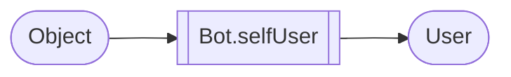

# Bot utility processors

## Before start

> When a processor is marked with a (*) it means that it can take anything as input.
> Like the processor TurnInto that is in BeepBeep core, the input is only to trigger the processor.
> 
{style="note"}

To use the Bot utility processors you need to have a Bot object, you can get it from the DiscordPalette object.

Here an example :
```java
JDA jdaBuilder = JDABuilder.createDefault(Main.token)
                .setActivity(Activity.watching("Playing with Lego"))
                .enableIntents(GatewayIntent.MESSAGE_CONTENT)
                .build();
                
DiscordPalette discordPalette = DiscordPalette.getInstance(jdaBuilder);

ApplyFunction getSelfUser = new ApplyFunction(discordPalette.selfUser);
```

## Bot

All previous processors are get data from an Object, like a Message object that is simply a JSON sent by Discord.\

```json
{
  "message": {
    "channelID": "123456789",
    "deleted": false,
    "id": "123456789",
    "type": "DEFAULT",
    "content": "Text",
    "authorID": "123456789",
    "pinned": false,
    ...
  }
}
```

And for example, the processor Author.name we call a function called `getName` that will return the name of the author.

But before all, the bot is also a User, and we can interact with it, so we need to have some processors to interact with the bot itself.

> The bot has a cache system that is loaded when the bot is started, so you can perform a lot a function like "getGuildFromID"
> without send a request to Discord.
> 
{style="note"}


## SelfUser (*)

This processor will return the Bot User object that represent the bot itself.
All processors that are in the User topic can be used with this processor.



## Status (*)

This processor is to get the Bot status as a String


## GuildFromId

This processor will return a Guild object from the ID of the guild.


