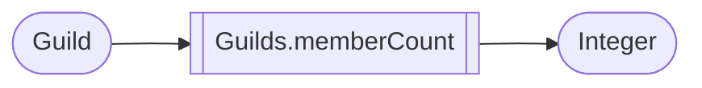
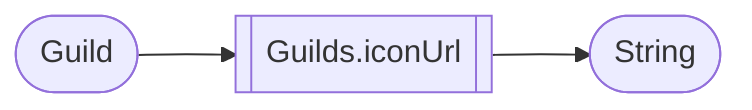

# Guilds

> Some of the processors extends BinaryFunction, this means that the processor needs two inputs to work.

## Id

## Name

## MemberCount

## Icon URL

## Owner

## Description

## Members

## Roles

## MemberFromUser

## MemberFromId

