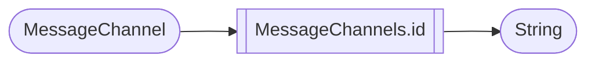
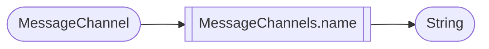
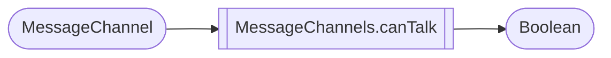
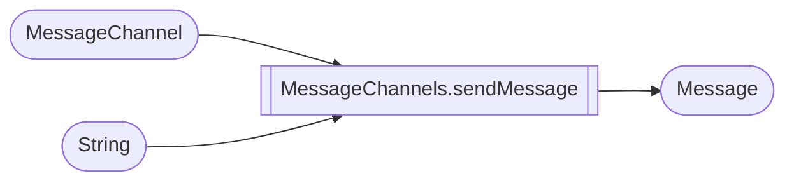

# MessageChannels

> Some processor inside this topic is particlar and will be explained in the processor section.

## Id

## Name

## Guild

## CanTalk

Output a boolean that indicates if the bot can send messages to the channel.

## SendMessage

> This processor is particular, it can perform an action and the actual way to send message on Discord from DiscordPalette.

`MessageChannel` is the channel where the message will be sent\
`String` is the content of the message\
`Message` is the "return" of the Message just sended so you can use it to perform other actions.

> If the message can't be sent due to an error (RateLimited, InsufficientPermission, etc...) the processor will return nothing.
{style="warning"}