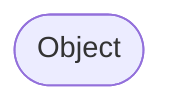
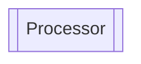
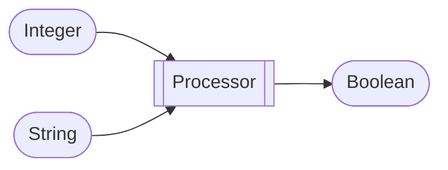

# Processors

DiscordPalette add a lot of various way to get Data from Discord and interact with it.\

All will be documented here with the purpose of the processor, function.

## Information about graph

The following documentation will contains graph, here how to interpret them:



`Object` is the input of the processor, it represent a type of Object.


`Processor` is the processor, it represent a processor.

Global example :



`Integer` is the first Input of the processor and represent an Integer Object\
`String` is the second Input of the processor and represent a String Object\
`Processor` is the processor (depend on the context)\
`Boolean` is the output of the processor and represent a Boolean Object

## General Code

Simply use the following line to get the processor:
```java
ApplyFunction desiredData = new ApplyFunction(Type.DESIRED_DATA);
```

Just replace `DESIRED_DATA` by the data you want to get, for example this is the way to get the message content :

```java
ApplyFunction author = new ApplyFunction(Messages.content);
```