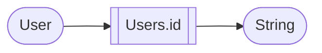
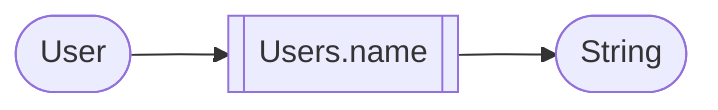
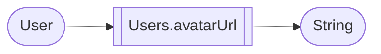

# Users

> The difference between a Member and a User is that a Member is a User that is in a Guild.
{style="note"}

> Each processor is a class that extends UnaryFunction so the use will be the same for all of them.

## Id

## Name

## Avatar URL

> Due to a Discord Update, user can have a different avatar per guild, so the processor will return the default avatar of the user.

